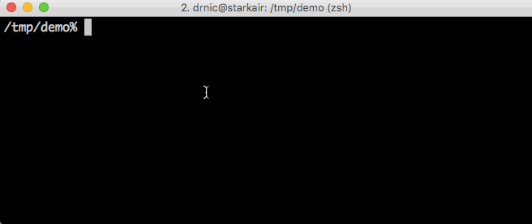

# Safely generate passwords in Vault



```
vault_base=${vault_base:-secret/tiny-tutorials-demo}

safe gen 20 $vault_base/staging/users/admin password
safe get $vault_base/staging/users/admin
```

The output will be like:

```
--- # secret/tiny-tutorials-demo/staging/users/admin
password: AAb1UB3ZaGl4ItE7d2jI

```

You can fetch any safe key (`password` in the example above) using the `:key` suffix:

```
safe get $vault_base/staging/users/admin:password
```

Will return just the value:

```
AAb1UB3ZaGl4ItE7d2jI
```
