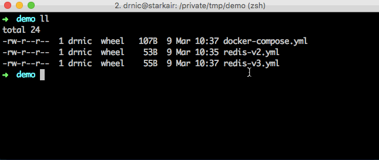

# Build docker-compose.yml with spruce merge

You can decompose a large `docker-compose.yml` into many smaller parts, or dynamically build various `docker-compose -f` files for testing permutations, using `spruce merge`.

```
docker-compose -f <(spruce merge docker-compose.yml redis-v2.yml) up
```



`spruce merge` specializes in merging the YAML/JSON objects from multiple files into a single object output. `docker-compose.yml` files are a great candidate.

Consider the desire to deploy `redis` inside `docker-compose up` but with different redis versions.

A default `docker-compose.yml` might use the `redis:latest` image:

```yaml
version: '2'
services:
  redis:
    container_name: redis
    image: redis:latest
    ports: ["6379:6379"]
```

An override YAML file might change the image to `redis:2.8`:

```yaml
services:
  redis:
    image: redis:2.8
```

Merge `redis-v2.yml` into the `docker-compose.yml` file:

```
spruce merge docker-compose.yml redis-v2.yml
```

The output will be:

```yaml
services:
  redis:
    container_name: redis
    image: redis:2.8
    ports:
    - 6379:6379
version: "2"
```

You can store this into a temporary file and pass to `docker-compose -f`:

```
spruce merge docker-compose.yml redis-v2.yml > /tmp/docker-compose-redis-v2.yml
docker-compose -f /tmp/docker-compose-redis-v2.yml up
```

Or, as in the original example, you can inline the `spruce merge` without ever creating an intermediate file:

```
docker-compose -f docker-compose.yml up
docker-compose -f <(spruce merge docker-compose.yml redis-v2.yml) up
docker-compose -f <(spruce merge docker-compose.yml redis-v3.yml) up
```
